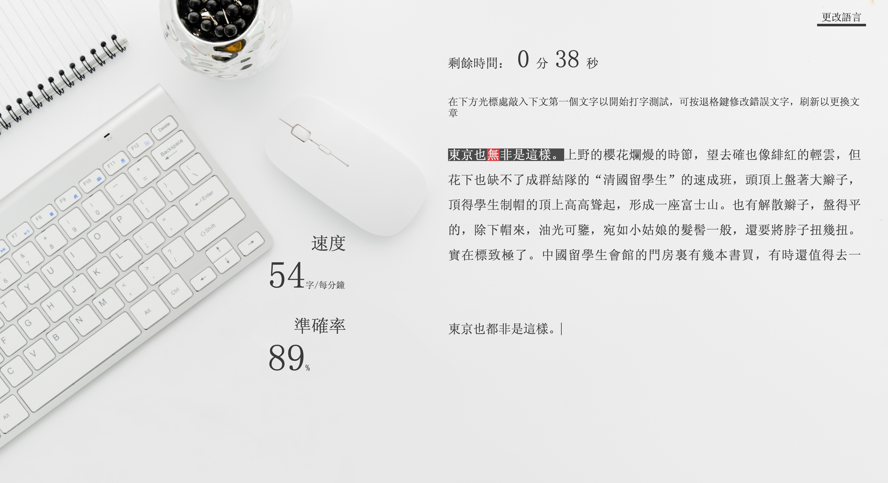

# Spring Boot Typing Test Application
 This is a web application built with Maven. Users could test their test speed and accuracy in 1 or 3 or 5 minutes.
 
 Test results would be submitted to the back-end(built with Java) and would be stored in Mysql database.
 
*Webpages in this application only have <code>traditional Chinese</code> version for the time being.*

## Run it locally
* create a database and a table using <code>schema.sql</code> file (which is in <code>/src/main/resources/db/mysql/</code>) and modify some of the database configurations in <code>application.properties</code> if neccessary.
* clone or download this project
```
cd *  
./mvnw package   
java -jar target/*.jar  
```
* visit <code>http://localhost:8080</code> in your browser

## Screenshots




  
